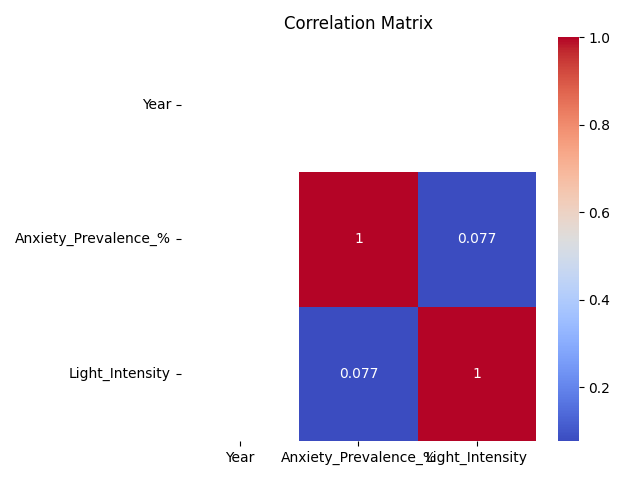
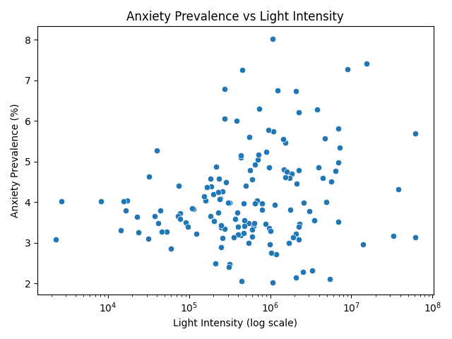
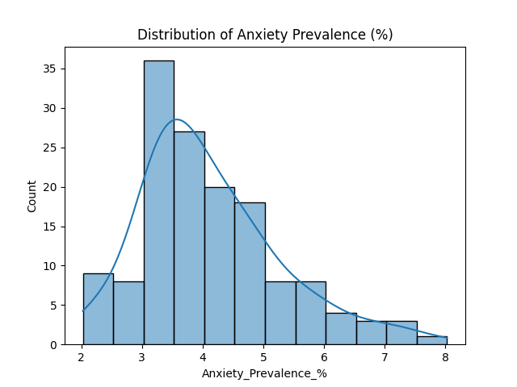
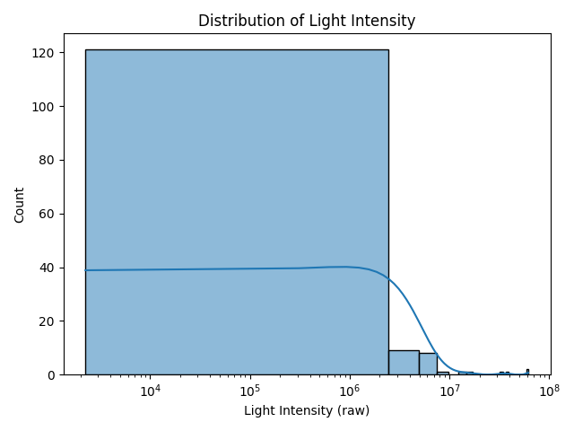
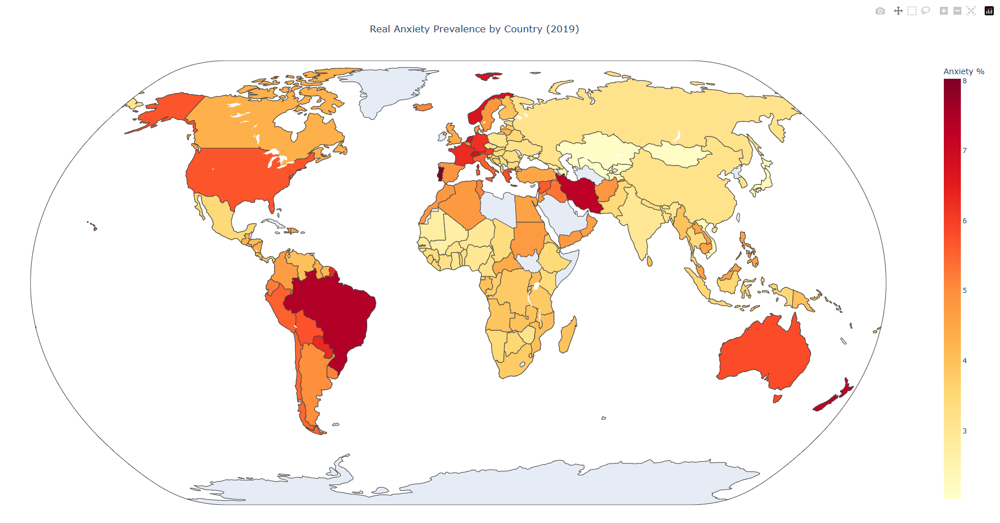

# 🌃 Night Anxiety Index


**Does the brightness of a city at night reflect the anxiety within?**  
This project explores a potential link between nighttime light intensity and the prevalence of anxiety disorders across countries, using real-world satellite and health data.

---

## 🎯 Objective

This research investigates whether high levels of artificial night lighting — often a proxy for urban activity and sleep disruption — are correlated with increased anxiety prevalence in national populations.

---

## 📊 Data Sources

All datasets used in this project are **real, open-access datasets**:

- 🛰 **VIIRS Nighttime Lights (NASA / NOAA)**  
  [Earth Observation Group - VIIRS DNB Composites](https://ngdc.noaa.gov/eog/viirs/)
  - Global satellite imagery of night light intensity (2013–2024)
  - Used to calculate country-level mean brightness in 2019

- 🧠 **Global Anxiety Prevalence (Our World In Data)**  
  [Anxiety disorders – OWID](https://ourworldindata.org/mental-health)
  - WHO-based mental health statistics (annual)
  - Used to extract 2019 prevalence per country

Both datasets were aligned via ISO 3-letter country codes and processed for analysis.

---

## 🧪 Methodology

1. **Data Preprocessing**
   - Cleaned and filtered both datasets to retain 2019 records.
   - Calculated average brightness per country.
2. **Dataset Merging**
   - Joined datasets on ISO country code.
3. **Exploratory Data Analysis (EDA)**
   - Plotted distributions, correlations, and scatter visualizations.
4. **Model Training**
   - Applied three regression models:
     - Linear Regression
     - Random Forest Regressor
     - XGBoost Regressor
   - Used log-transformed inputs and scaling.
5. **Result Visualization**
   - Generated evaluation plots and residuals.

---

## 📈 Results

| Model            | MAE   | RMSE  | R²      |
|------------------|-------|-------|---------|
| Linear Regression| 1.03  | 1.31  | -0.27   |
| Random Forest    | 0.97  | 1.20  | -0.06   |
| XGBoost          | 1.12  | 1.49  | -0.63   |

📌 *Conclusion*: The correlation is weak, but the Random Forest model slightly outperformed others.

---

## 🖼 Visual Insights

### 🔍 Correlation Matrix  
Shows weak correlation between night light and anxiety prevalence.



---

### 🌕 Scatter Plot: Light vs Anxiety  
Scatter plot (with log-scaled light axis) shows no strong pattern.



---

### 📊 Histogram: Anxiety Prevalence  
Distribution of anxiety rates across countries in 2019.



---

### 💡 Histogram: Nighttime Light Intensity  
Highly skewed distribution — most countries have low brightness, few have extreme values.



---

### 🏆 Top 10 Countries by Anxiety & Light  
Sorted CSV tables are available:
- [`top10_anxiety.csv`](outputs/plots/top10_anxiety.csv)
- [`top10_light.csv`](outputs/plots/top10_light.csv)

---

## 🧠 Research Takeaways

Despite limited statistical correlation, this project illustrates:
- A novel way to connect environmental indicators to mental health data.
- The complexity of modeling mental health using external, indirect variables.
- Opportunities for deeper research with more granular or temporal data.

---

### 🌐 Global Anxiety Prevalence (2019)

Choropleth visualization based on WHO mental health statistics.  
Each country is colored by the share of population with anxiety disorders in 2019.



🔗 [Click here to open the interactive version (locally)](outputs/plots/final_anxiety_map.html)

---

## 🚀 How to Run

```bash
# 1. Install dependencies
pip install -r requirements.txt

# 2. Run full pipeline
python run_pipeline.py
````

All outputs will be saved to:

* `outputs/plots/`
* `outputs/reports/`
* `models/`

---

## 🗂 Project Structure

```
├── data/
│   ├── raw/                # Original datasets (satellite + health)
│   └── processed/          # Cleaned, merged data
├── scripts/                # Preprocessing, modeling, EDA scripts
├── outputs/
│   ├── plots/              # Visualizations and top-10 exports
│   └── reports/            # Model evaluation CSV
├── models/                 # Saved ML models
├── run_pipeline.py         # Full automated pipeline
├── README.md               # Project documentation
```

---

## 📜 License

This project is licensed under the [Apache License 2.0](LICENSE).

---
